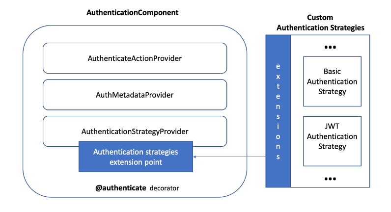
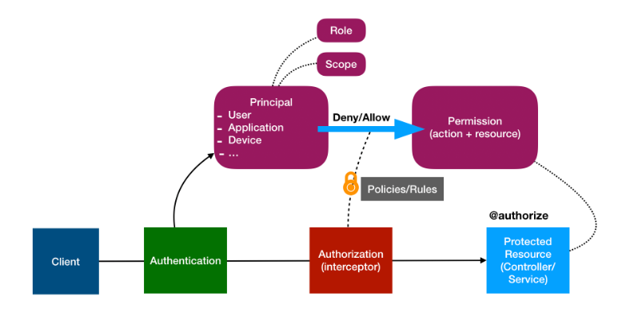

# Sistema De Gestión De Mascotas (sigma)

## Pre-requisitos

Se requiere Node.js == 18.12, Loopback 4 y ejecutar instancias de un servidor MongoDB (Mongodb Atlas) para que la aplicación se inicie. MongoDB se usa para la base de datos de los modelos de la aplicación.

## Paquetes Utilizados

`
$ npm install --save @loopback/authentication
`





Este paquete contiene la lógica central para la capa de autenticación en LoopBack 4.

Contiene:

* Un decorador para expresar un requisito de autenticación en los métodos del controlador.
* Un proveedor para acceder a metadatos de autenticación a nivel de método.  
* Una acción en la secuencia REST para hacer cumplir la autenticación (ya no es necesaria para la secuencia basada en middleware)  
* Un punto de extensión para descubrir todas las estrategias de autenticación y manejar su delegación.  

`$ npm install @loopback/authorization`  




El siguiente ejemplo muestra el uso básico del @authorizedecorador, el autorizador y el componente de autorización mediante la autorización de un cliente según su rol:

ASUMIENDO que su aplicación utiliza jwt como estrategia de autenticación y que la información del usuario está codificada en el token del encabezado de una solicitud.

`$ npm install isemail`

Determina si el correo electrónico es válido o no, para diversas definiciones del mismo. Opcionalmente acepta un options objet. Las opciones pueden incluir errorLevel.

Se puede usar el error level para especificar el tipo de resultado para validate(). Pasar un false literal dará como resultado un booleano verdadero o falso que indica si la dirección de correo electrónico está suficientemente definida para usarla al enviar un correo electrónico.

Pasar un true literal dará como resultado un estado numérico más granular, siendo 0 una dirección de correo electrónico perfectamente válida.

```npm
$ npm install jsonwebtoken
$ npm i -D @types/bcryptjs
```

## Instalación

Sigue los siguientes pasos para clonar e iniciar el proyecto.

```git
git clone https://github.com/jalvarezy/sigma.git
cd sigma
npm i
```

## Pruebas

`npm start`

## Modelos

**1. User -**  Esta entidad representa a los usuarios del sistema.  
**2. UserCredentials -**  Esta entidad es para las credenciales confidenciales de los usuarios.  
**3. Product -** Representa una entidad para los productos ofrecidos por Mascota Feliz  
**4. KeyAndPassword -** Este modelo modelo es para representar la solicitud de restablecimiento de contraseña del usuario.  
**5. EmailTemplate -** Este modelo es para representar la plantilla de solicitud de correo electrónico para Nodemailer.  
**6. NodeMailer -** Este modelo es para representar la respuesta de Nodemailer después de enviar el correo electrónico de restablecimiento de contraseña.  
**7. ResetPasswordInit -** Este modelo es para representar la solicitud del paso inicial de restablecimiento de contraseña.  
**8. Service -** Representa una entidad para los servicios ofrecidos por Mascota Feliz  
**9. Prospect -** Representa una entidad para identidicar y facilitar el contacto de los clientes potenciales.

**User** y **Pet**  se marcan de 1 a muchos utilizando el decorador de modelo **@HasMany** porque un cliente puede tener muchas mascotas y como **Pet** perteneciente a **User** utilizando el decorador de modelo **@BelongsTo**.

**User** y **UserCredentials**  se marcan de 1 a 1 utilizando el decorador de modelo **@HasOne** porque un cliente puede tener una sola credencial de autenticación.

**Pet** y **Plan**  se marcan de 1 a 1 utilizando el decorador de modelo **@HasOne** porque una mascota puede tener o adquirir un solo plan.

## Controladores

**1. user-management -** Controlador para crear, obtener información, actualizar información de usuarios e iniciar sesión.

**2. product -** Controller para la gestión del catálogo de productos.

**3. service -** Controller para la gestión del catálogo de servicios.

**4. pet -** Controlador para crear, obtener información, actualizar información de las mascotas.

**5. plan -** Controlador para crear, obtener información, actualizar información de las mascotas.

**6. prospect -** Controlador para crear y obtener información sobre los prospectos de usuarios potenciales.

**7. branch -** Controlador para crear, obtener información, actualizar información de las sucursales.

## Servicios

**1. user-management -** Este servicio es el responsable de verificar si el usuario existe y la contraseña enviada al servidor coincide con la de un usuario existente.

**2. hash.password.bcryptjs -** Este servicio es el responsable de generar y comparar los hashes de las contraseñas.

**3. validator -** Este servicio es el responsable de válidar el correo electrónico y la contraseña cuando se crea o registra un nuevo usuario.

**4. jwt -** Este servicio es el responsable de generar y verificar  los JSON Web Token.

**5. email -** Este servicio es el responsable de enviar el correo electrónico de restablecimiento de contraseña.

**6. basic-authorizor -** Este servicio es el responsable de  autorizar y negar accesos.

***En contrucción...***


